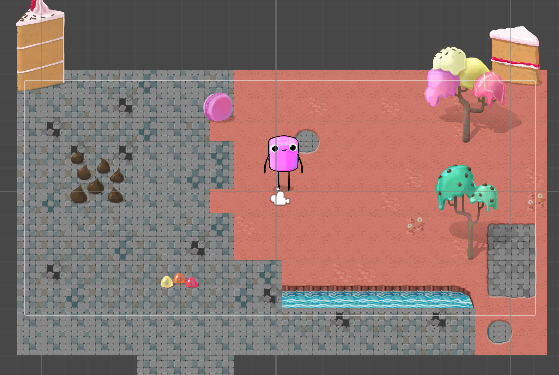

# Robot Repair — Protasyk

Навчальний проєкт Unity.

## Щоденник розробника

### 16.09.2026 — Юніт 1: персонаж і рух
* **Що зроблено:** Налаштовано спрайти підлоги (Tilemap) та персонажа. Створено скрипт `PlayerController`, додано керування за допомогою `Input System` через WASD, стрілочки та стік геймпада.
* **Що не вийшло або забрало найбільше часу:** Виправлення помилок із прив'язкою вектору `MoveAction` в Inspector та первинна синхронізація з веб-гітом.
* **Що зрозумів про Update і Time.deltaTime:** Метод `Update` викликається щокадру, а `Time.deltaTime` дозволяє прив'язати швидкість руху до реального часу (секунд), щоб персонаж рухався однаково на будь-якому ПК.
* **Що робитиму далі:** У Юніті 2 буду налаштовувати фізику (`Rigidbody2D`) та коллайдери для перешкод і стін.
=======
# Robot Repair — Protasyk

Навчальний проєкт Unity.

## Щоденник розробника

### 16.09.2026 — Юніт 1: персонаж і рух
* **Що зроблено:** Налаштовано спрайти підлоги (Tilemap) та персонажа. Створено скрипт `PlayerController`, додано керування за допомогою `Input System` через WASD, стрілочки та стік геймпада.
* **Що не вийшло або забрало найбільше часу:** Виправлення помилок із прив'язкою вектору `MoveAction` в Inspector та первинна синхронізація з веб-гітом.
* **Що зрозумів про Update і Time.deltaTime:** Метод `Update` викликається щокадру, а `Time.deltaTime` дозволяє прив'язати швидкість руху до реального часу (секунд), щоб персонаж рухався однаково на будь-якому ПК.
* **Що робитиму далі:** У Юніті 2 буду налаштовувати фізику (`Rigidbody2D`) та коллайдери для перешкод і стін.

### ДД.ММ.РРРР — Юніт 2: оточення і фізика
Що зроблено: ...
Що не вийшло або забрало найбільше часу: ...
Що зрозумів про FixedUpdate і колайдери: ...
Що в рівні вийшло не так, як у фізичному паспорті, і чому: ...
Що робитиму далі: ...
План гри 

### 01.10.2026 — Юніт 3: оточення і фізика
* Що зроблено: Налаштував Rigidbody2D, колайдери та рух персонажа.
* Що не вийшло: Персонаж спочатку тремтів і проходив крізь перешкоди.
* Що зрозумів: FixedUpdate використовується для фізики, а Collider відповідає за зіткнення.
* Що вийшло не так: Персонаж обертався через налаштування Rigidbody2D.
* Що робитиму далі: Перевірю всі колайдери та зіткнення на рівні.
